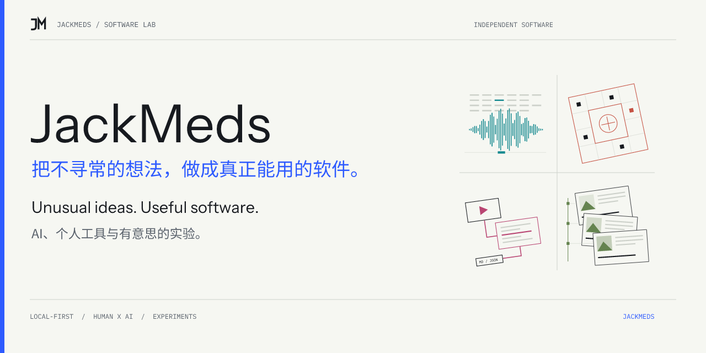
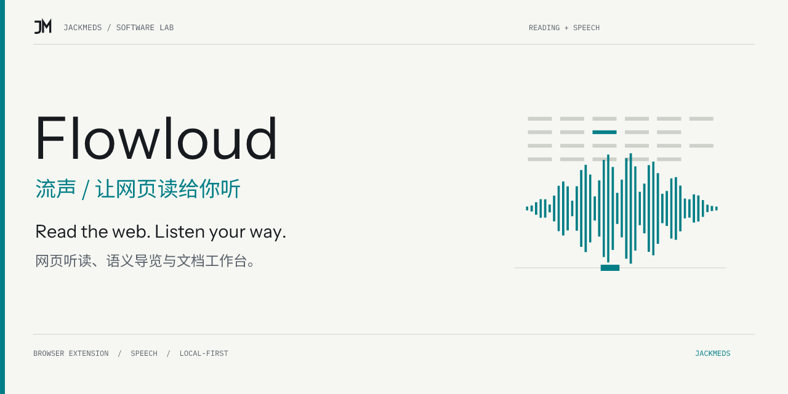

# JackMeds GitHub Brand

**把不寻常的想法，做成真正能用的软件。**

JackMeds 的 GitHub 品牌工作区。Functional Specimen 将网页听读、确定性计算、视频笔记和个人回忆转成各自的视觉图形，共用原创 JM 标记与一致的排版。

## A system for real projects

- 1200 × 360 light/dark Hero SVGs with outlined lettering.
- 1280 × 640 social-preview PNGs, below GitHub's 1 MB limit.
- Original JM avatar, project-specific motifs and accessible Markdown headers.
- Real fictional-data product screenshots with capture provenance.
- Deterministic generation, read-only checks, and lightweight reusable CI.
- Public README/settings rollback baselines; original avatar bytes stay in a local ignored backup.

## Use the toolkit

Requires Node.js 24. Install dependencies here once; target repositories need no brand-tool dependencies.

    npm ci
    npm run brand -- --repo /absolute/path/to/project
    npm run brand:check -- --repo /absolute/path/to/project
    npm test

Each target holds project-brand.json. Only marked README header regions and assets/brand generated files are rewritten; product copy and screenshot evidence remain separate.

The initial inputs in projects/ cover the profile, four pilots and seven historical repositories. A standalone clone can generate any target repository. To build the complete local review gallery, place the target checkouts in a sibling github-brand-workspace directory, then run npm run preview.

## Review and publication

[Delivery and draft PRs](docs/DELIVERY.md) · [Design system](DESIGN.md) · [Operating guide](docs/OPERATIONS.md) · [Repository audit](docs/REPOSITORY-AUDIT.md) · [Prepared metadata](release/metadata.json)

All migrations are reviewed through individual pull requests. Account avatar/Pins/social settings and MingXu's repository/domain switch follow the agreed review milestone. Generating an image does not upload it to GitHub's Social preview setting.

Forks and archived repositories retain their existing presentation. Existing license and author notices are preserved; no project license is chosen by this refresh.

Font sources and upstream OFL licenses are bundled in assets/fonts. Generated lettering is outlined and carries font notices. This repository is not configured for npm publication.
